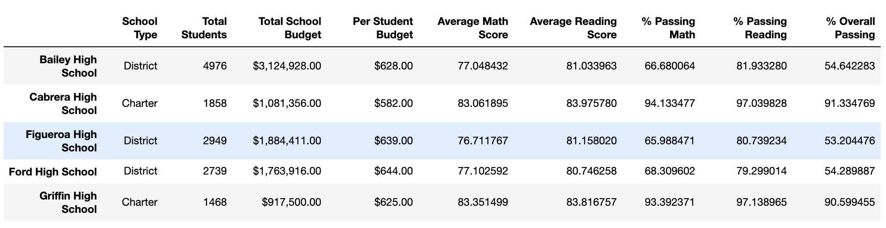
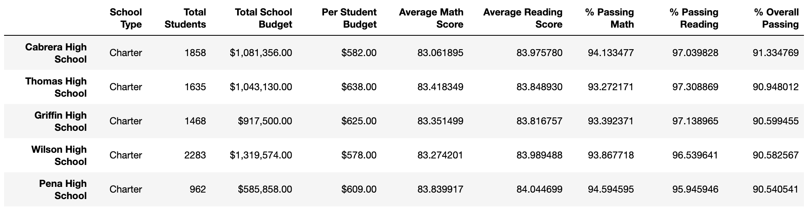
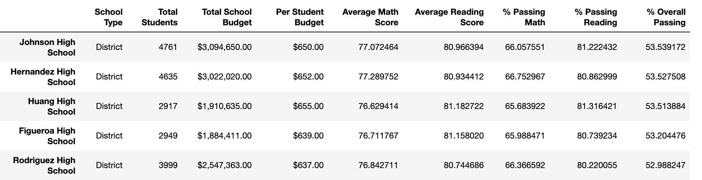
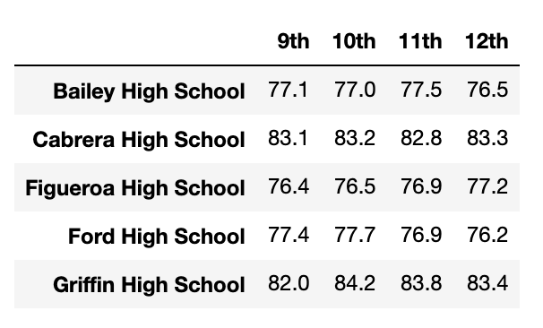
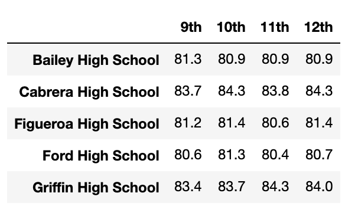

# School District Analysis
School District performance analysis with Pandas, using Jupyter

## Overview
The main purpose of this project was to review the performance of high schools in a given school district, based on the math and reading scores of their students on standardized tests. Two separate CSVs, one recording information about the various high schools, and another about all of the high school students in the district, were reviewed, cleaned, and then combined prior to being subject to various analyses.

The initial analysis consisted of a per-school overview of student population, budget, per-student budget, average math & reading scores, and percentage of students with passing grades.

This was also accompanied by a rating of...

... the top-five...

... and bottom-five performing schools, determined by the overall passing percentage of students at these schools.

The next level of analysis looked at average Math & Reading scores at each high school, by grade level.

## Results

## Summary